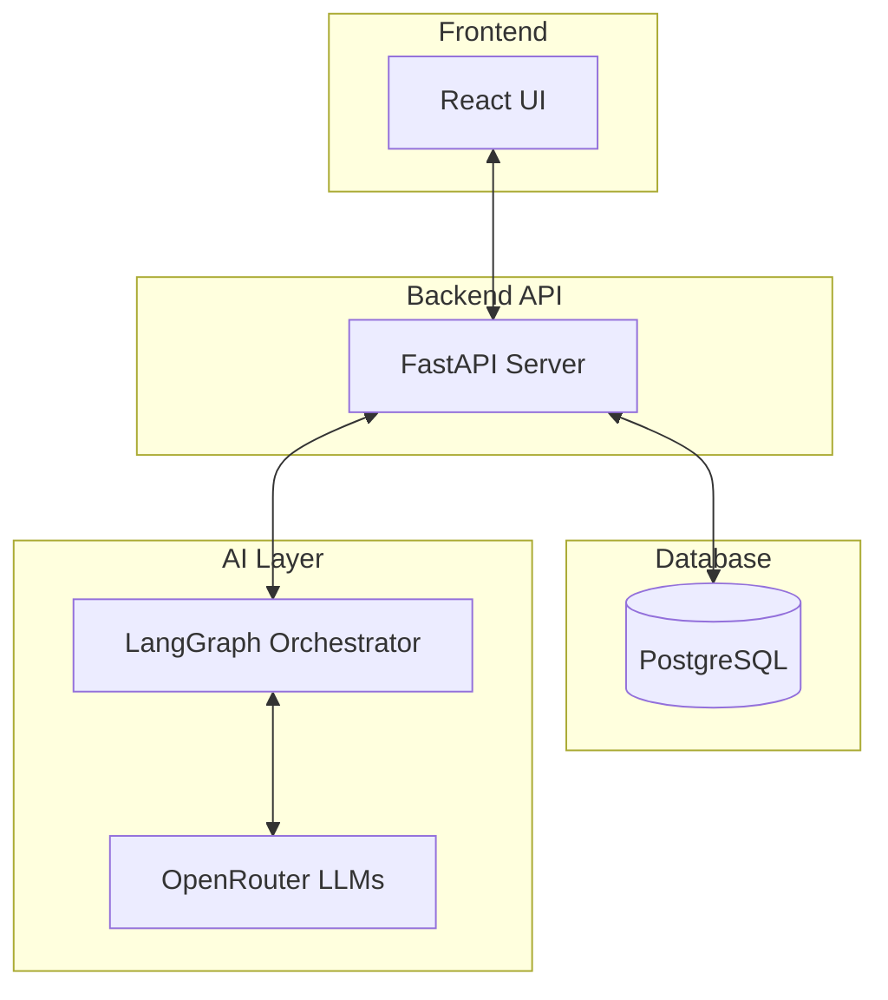
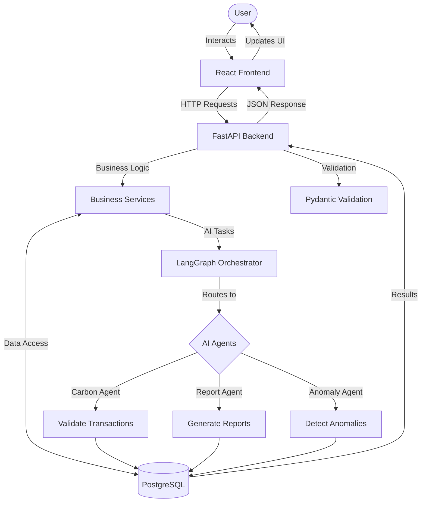
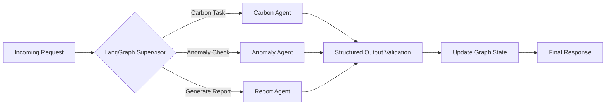
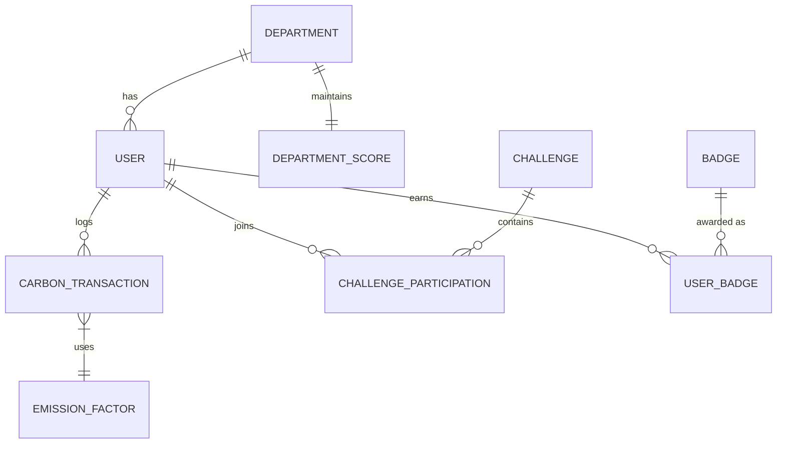
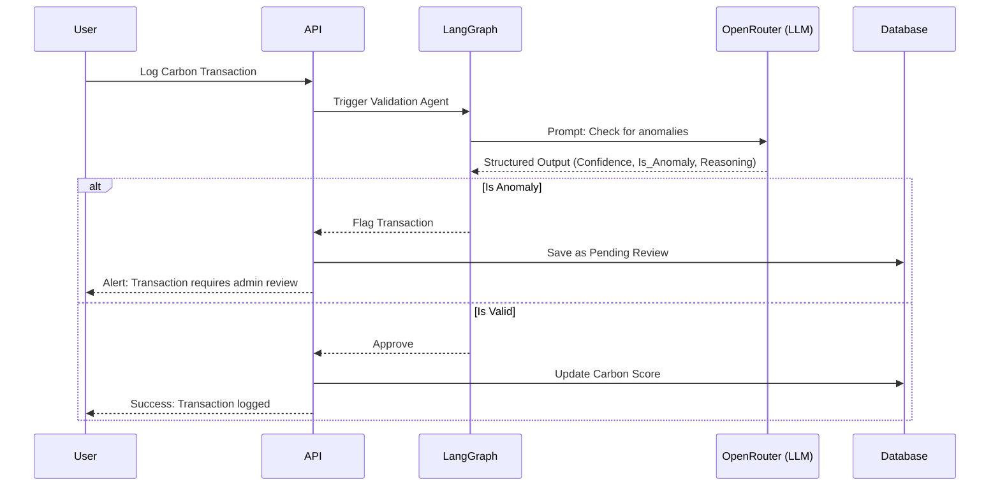

<div align="center">

# 🌍 EcoSphere

**An AI-driven Environmental, Social, and Governance (ESG) Management Platform.**

[](https://reactjs.org/)
[](https://fastapi.tiangolo.com/)
[](https://langchain.com/)
[](https://www.postgresql.org/)
[](https://opensource.org/licenses/MIT)

**Status:** Active Development | **Version:** 1.0.0

</div>

---

## 📑 Table of Contents

1. [Problem Statement](#problem-statement)
2. [Solution Overview](#solution-overview)
3. [Key Features](#key-features)
4. [Functional Requirements](#functional-requirements)
5. [Non-Functional Requirements](#non-functional-requirements)
6. [System Architecture](#system-architecture)
7. [Overall System Flow](#overall-system-flow)
8. [AI Architecture](#ai-architecture)
9. [Repository Structure](#repository-structure)
10. [Technology Stack](#technology-stack)
11. [Database Design](#database-design)
12. [API Design](#api-design)
13. [Security Architecture](#security-architecture)
14. [AI Decision Pipeline](#ai-decision-pipeline)
15. [How the System Works](#how-the-system-works)
16. [ESG Scoring Engine](#esg-scoring-engine)
17. [Project Workflow](#project-workflow)
18. [Configuration](#configuration)
19. [Local Development](#local-development)
20. [Testing](#testing)
21. [Performance Optimizations](#performance-optimizations)
22. [License](#license)
23. [Authors](#authors)
24. [Acknowledgements](#acknowledgements)

---

## 🚨 Problem Statement

**The ESG Problem**
Organizations face increasing pressure to track and report their Environmental, Social, and Governance (ESG) metrics. 

**Inefficient Workflows**
Current workflows rely heavily on manual data entry, fragmented spreadsheets, and siloed systems, leading to inaccurate reporting, compliance risks, and inability to track real-time progress.

**Why AI is Useful**
Artificial Intelligence can automate data extraction, detect anomalies in reporting, recommend actionable ESG challenges, and dynamically generate compliance reports.

**Why EcoSphere Exists**
EcoSphere provides a unified, AI-assisted platform that makes tracking ESG metrics intuitive, accurate, and engaging through gamification.

---

## 💡 Solution Overview

**Solving the Problem**
EcoSphere digitizes the entire ESG tracking lifecycle. By integrating departments, users, and AI agents, it creates a single source of truth for all ESG activities.

**Overall Workflow**
Users log ESG activities (e.g., carbon transactions, social initiatives). The AI layer validates these logs, updates the organization's ESG scores, and rewards employees with badges and leaderboard points.

**AI-Assisted ESG Management**
Our LangGraph-powered orchestrator dynamically routes tasks to specialized agents (Carbon, Report, Anomaly, Recommendation) to ensure data integrity and actionable insights.

**Production-Grade Architecture**
Built on FastAPI, React, PostgreSQL, and Docker, EcoSphere is scalable, secure, and ready for enterprise deployment.

---

## ✨ Key Features

### Environmental
- **Carbon Tracking:** Log and calculate carbon emissions across various categories.
- **Emission Factors:** Manage industry-standard emission factors for accurate calculations.

### Social
- **CSR Activities:** Track Corporate Social Responsibility initiatives.
- **Employee Participation:** Monitor employee engagement in social causes.

### Governance
- **Policy Management:** Distribute and track acknowledgement of corporate policies.
- **Compliance Audits:** Log and resolve compliance issues.

### Gamification
- **Challenges:** Create and participate in ESG-related challenges.
- **Badges & Leaderboards:** Reward employees for positive ESG contributions.

### Artificial Intelligence
- **Automated Validation:** AI agents validate carbon logs for anomalies.
- **Smart Recommendations:** AI suggests relevant challenges based on user profiles.
- **Report Generation:** LLMs synthesize complex ESG data into readable reports.

### Administration
- **Department Management:** Track ESG scores at the department level.
- **User Roles:** Role-Based Access Control (RBAC) for admins and regular users.

### Analytics & Reporting
- **ESG Dashboards:** Real-time visualization of Environmental, Social, and Governance scores.
- **Exportable Reports:** Export data in PDF/Excel formats.

### Security
- **JWT Authentication:** Secure API access.
- **Structured Outputs:** Pydantic validation ensures AI outputs conform to expected schemas.

### Developer Experience
- **Dockerized Environment:** One-command setup using `docker-compose`.
- **Alembic Migrations:** Automated database schema management.

---

## 📋 Functional Requirements

### Authentication & Users
- System must allow user registration and JWT-based login.
- System must support RBAC (Admin, Employee).

### Environmental Module
- System must record carbon transactions with associated emission factors.
- System must calculate total carbon footprint per department.

### Social Module
- System must track CSR activities and participant hours.

### Governance Module
- System must distribute policies and track user acknowledgements.
- System must log compliance audits and resolution status.

### Gamification Module
- System must award badges for completing specific ESG goals.
- System must display a global and departmental leaderboard.

### AI & Reporting
- AI must validate carbon entries for anomalous values.
- AI must generate monthly ESG summaries.

---

## 🚀 Non-Functional Requirements

- **Scalability:** Stateless FastAPI backend and React frontend allow horizontal scaling.
- **Performance:** Asynchronous PostgreSQL drivers (`asyncpg`) and React Query (`@tanstack/react-query`) for fast data fetching.
- **Reliability:** Dockerized services ensure consistent environments.
- **Availability:** Configurable for high availability behind a load balancer.
- **Security:** Bcrypt password hashing, JWT tokens, and Pydantic validation.
- **Maintainability:** Modular repository structure (routers, models, schemas, services).
- **Observability:** `structlog` for structured logging.
- **Extensibility:** LangGraph agent architecture allows easy addition of new AI capabilities.
- **Portability:** Containerized via Docker.
- **Accessibility:** Semantic HTML and ARIA labels in the React frontend.
- **Usability:** Intuitive UI built with Tailwind CSS and Framer Motion.
- **Fault Tolerance:** API rate limiting (`slowapi`) and robust error handling.
- **Consistency:** SQLAlchemy ORM ensures database transaction integrity.
- **Auditability:** Dedicated audit trail models for compliance tracking.

---

## 🏗️ System Architecture



---

## 🔄 Overall System Flow



---

## 🧠 AI Architecture

EcoSphere utilizes **LangGraph** to manage complex, multi-step AI reasoning pipelines. 

- **Supervisor:** Routes tasks to specialized agents.
- **Carbon Agent:** Evaluates the environmental impact of logged transactions.
- **Report Agent:** Synthesizes database metrics into human-readable narratives.
- **Anomaly Agent:** Detects outliers in reported ESG data.
- **Recommendation Agent:** Suggests challenges to users based on their activity.

**State Management:** LangGraph maintains conversational and processing state across agent invocations.
**Structured Outputs:** Uses LangChain with OpenAI/OpenRouter tools to enforce Pydantic schemas, ensuring the AI returns predictable JSON.
**Confidence Validation:** Agents assign confidence scores to their outputs; low confidence triggers human-in-the-loop review.



---

## 📂 Repository Structure

```text
ODOO_HACK/
├── ai/                 # LangGraph orchestrator, agents, and prompts
├── alembic/            # Database migration scripts
├── api/                # API configurations and dependency injection
├── config/             # Application and environment configurations
├── core/               # Core utilities, logging, and exceptions
├── database/           # Database connection and session management
├── dependencies/       # FastAPI dependencies (auth, DB sessions)
├── frontend/           # React frontend application (Vite)
│   ├── src/            # UI components, pages, and hooks
│   └── public/         # Static assets
├── middleware/         # Custom FastAPI middlewares (CORS, Rate Limiting)
├── models/             # SQLAlchemy ORM models (Database entities)
├── routers/            # FastAPI route handlers (Controllers)
├── schemas/            # Pydantic models (Data validation)
├── security/           # JWT, password hashing, and RBAC logic
├── services/           # Business logic layer
├── tests/              # Pytest test suite
├── utils/              # Helper functions
├── docker-compose.yml  # Docker deployment configuration
├── main.py             # FastAPI application entry point
└── requirements.txt    # Python dependencies
```

---

## 💻 Technology Stack

| Category | Technology | Reason |
|----------|------------|--------|
| **Frontend** | React 19, Vite, Tailwind CSS | High performance, modern UI, rapid development. |
| **Backend** | FastAPI, Python | Asynchronous, extremely fast, built-in validation via Pydantic. |
| **Database** | PostgreSQL, asyncpg, SQLAlchemy | Reliable relational data, async I/O, robust ORM. |
| **Authentication**| PyJWT, bcrypt | Secure stateless authentication. |
| **AI** | LangGraph, LangChain, OpenRouter | State-of-the-art agent orchestration and LLM integration. |
| **DevOps** | Docker, Docker Compose | Consistent environments across dev and production. |
| **Testing** | Pytest, pytest-asyncio | Comprehensive testing framework for async Python. |

---

## 🗄️ Database Design



- **USER**: Stores credentials and profile data.
- **DEPARTMENT**: Organizational units.
- **DEPARTMENT_SCORE**: Aggregated E, S, and G scores.
- **CARBON_TRANSACTION**: Logs of environmental impact.
- **EMISSION_FACTOR**: Multipliers for calculating carbon footprint.
- **CHALLENGE**: Gamified ESG goals.
- **BADGE**: Rewards for challenge completion.

---

## 🔌 API Design

### Authentication
- `POST /api/auth/login` - Authenticate and receive JWT.
- `POST /api/auth/register` - Register a new user.

### Environmental
- `POST /api/environmental/carbon` - Log a new carbon transaction.
- `GET /api/environmental/factors` - List emission factors.

### Social
- `POST /api/social/csr` - Log a CSR activity.
- `GET /api/social/activities` - List social activities.

### Governance
- `POST /api/governance/policy` - Create a new policy.
- `POST /api/governance/audit` - Log an audit finding.

### Gamification
- `GET /api/gamification/leaderboard` - Fetch current leaderboard.
- `POST /api/gamification/challenge/join` - Join a challenge.

### AI
- `POST /api/ai/validate` - Trigger AI validation on a transaction.
- `POST /api/ai/recommend` - Get AI challenge recommendations.

---

## 🛡️ Security Architecture

- **JWT:** Stateless, tamper-proof authentication tokens.
- **RBAC:** Middleware checks user roles (Admin vs User) before granting access.
- **Validation:** Pydantic strictly validates all incoming request bodies.
- **Rate Limiting:** `slowapi` prevents brute-force and DDoS attacks.
- **Structured Outputs:** Prevents AI from injecting malicious payloads by forcing strict JSON schemas.
- **Secrets Management:** Managed via `.env` files, never committed to source control.

---

## 🤖 AI Decision Pipeline



---

## ⚙️ ESG Scoring Engine

EcoSphere calculates scores continuously based on business rules:
- **Environmental Score:** Inversely proportional to carbon emissions vs. target goals.
- **Social Score:** Driven by volunteer hours and CSR participation.
- **Governance Score:** Based on policy acknowledgements and audit resolutions.
- **Overall Score:** Weighted average (e.g., 40% E, 30% S, 30% G) configured by the organization.

---

## 🛠️ Configuration

Configure via `.env` in the root directory:

```env
DATABASE_URL=postgresql+asyncpg://postgres:postgres@db:5432/ecosphere
SECRET_KEY=your_super_secret_jwt_key
ALGORITHM=HS256
ACCESS_TOKEN_EXPIRE_MINUTES=30

OPENROUTER_API_KEY=your_openrouter_key
LANGCHAIN_TRACING_V2=true
LANGCHAIN_API_KEY=your_langsmith_key
```

---

## 💻 Local Development

1. **Clone the repository:**
   ```bash
   git clone <repo-url>
   cd ODOO_HACK
   ```

2. **Environment:**
   Copy `.env.example` to `.env` and fill in the values.

3. **Backend & Database (Docker):**
   ```bash
   docker-compose up -d db
   # Install local deps if running outside docker
   python -m venv venv
   source venv/bin/activate
   pip install -r requirements.txt
   alembic upgrade head
   uvicorn main:app --reload
   ```

4. **Frontend:**
   ```bash
   cd frontend
   npm install
   npm run dev
   ```

---


## 🧪 Testing

- **Unit Tests:** Located in `tests/`. Run with `pytest`.
- **API Tests:** Integration tests using `httpx` and `pytest-asyncio`.
- **Future Strategy:** Implement Playwright for frontend E2E testing.

---

## ⚡ Performance Optimizations

- **Async Execution:** `asyncpg` and FastAPI for non-blocking I/O.
- **Connection Pooling:** SQLAlchemy configured with optimal pool sizes.
- **Caching:** React Query caches frontend responses.
- **Structured Outputs:** Reduces LLM parsing errors and retries.

---


## 📄 License

MIT License. See [LICENSE](LICENSE) for details.

---

## 👥 Authors

- Contributor 1
- Contributor 2

---

## 🙏 Acknowledgements

- Built with [FastAPI](https://fastapi.tiangolo.com/) and [React](https://react.dev/).
- AI powered by [LangGraph](https://langchain-ai.github.io/langgraph/) and [OpenRouter](https://openrouter.ai/).
- Styled with [Tailwind CSS](https://tailwindcss.com/).